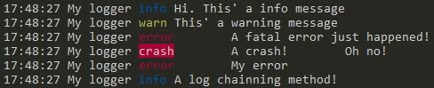
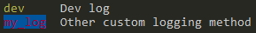
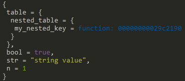
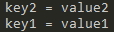

# Lualog
This is a simple logger for Lua.

Create a simple logger for Lua with some configurations as show date, stylized tags and logger name.

**Not works with Luvit** (due to Luvit custom `require` function)

# Install

## Using Luarocks
```bash
luarocks install lualog
luarocks install lualog --local # local instalation
luarocks install lualog --tree lua_modules # current directory installation to lua_modules folder
```
## Manual

Download this repository and copy the folder **lualog** and place it at **root folder of your proyect**.

# Usage
```lua
-- Example
local Lualog = require'lualog'

local logger = Lualog.new{ -- you can use Lualog() instead Lualog.new
    tag = 'My logger', -- a logger tag. default: ''
    styles = {dev = 'yellow', crash = 'bgred'}, -- define custom methods and their style. default: {}
    ignore_levels = {'dev'}, -- ignore levels (array). default: {}
    datestring = '%H:%M:%S', -- date string for os.date(). default: false => Not show
    table_inspect = { -- table-inspect plugin config
        prettyfy = true, -- pretty print tables. default: false
        allow_tostring = true, -- allow use table __tostring metamethod. default: true
        level_depth = 0 -- max nested level to inspect. default: 0. 0 means no level limit
    },
    plugins = {'table-inspect'} -- add plugins to log items. table-inspect is a optional predefined plugin.
                               -- You can add function plugins here too. See as define a plugin at Plugin section. default: {} => no plugins added.
}
-- Default logging methods
logger.info('Hi. This\' a info message')
logger.warn('This\' a warning message')
logger.error('A fatal error just happened!')

-- Custom methods defined at initiation instance
logger.dev('Ignored level. See ignore_levels table field') -- This log is ignored due to ignore_levels = {'dev'}
logger.crash('A crash!','Oh no!') -- Support multiple args
logger.error('My error').info('A log chainning method!') -- chain logging methods but they print at new lines
```

Result:



# Styles: customize the tag of your custom logging methods

If you want to create your custom logging methods, you can add a custom style:

- Color text: `black, red, green, yellow, blue, magenta, cyan, white`
- Background color: `bgblack, bgred, bggreen, bgyellow, bgblue, bgmagenta, bgcyan, bgwhite`
- Others styles: `bold, underlined, reversed`

Add custom logging methods in options table when you init your instance with:

```lua
local Lualog = require'lualog' -- equal to require('lualog')
local logger = Lualog.new({
    styles = {
        dev='yellow', -- tag = style
        my_log= 'red.bgblue' -- you can combine styles, red color and blue background for this method.
    }
})

-- and using them
logger.dev('Dev log')
logger.my_log('Other custom logging method')
```
Result:



# Methods of instance

When you create a Lualog instance, this has these methods (by default):

## Default logging methods

- `.info(...)` - log method with style `blue` and tag `info`
- `.warn(...)` - log method with style `yellow` and tag `warn`
- `.error(...)` - log method with style `red` and tag `error`


## Advanced methods

- `:print(...)`: function as `print` global function but **apply your plugins**. Or call your Lualog instance, logger in examples, as a function `logger(...)`.

*Tip: call your Lualog instance as function instead `:print()`*
```lua
logger:print(a_number, a_boolean, a_string, a_table)
-- or better, you can only call your logger as function! It's the same ;)
logger(a_number, a_boolean, a_string, a_table) -- you got a custom print function with custom logging plugins!
```
- `:use(...)`: add plugins to queue. See Plugin section.

- `:paint(style, text)`: return a colorized string. Use a print method to see it at console/terminal.
```lua
local my_blue_string = logger:paint('blue','This string will be blue if is printed')
print(my_blue_string)
```

- `:inspect(table)`: inspect a table with **table_inspect** configuration defined at initiation the instance or default if not.
```lua
local my_table = {
    str = 'string value',
    n = 1,
    bool = true,
    table = {
        nested_table = {
            my_nested_key = function() return 0 end
            }
        }
    }

logger:inspect(my_table) -- inspect a table with yor table_inspect config defined or use default values. No plugin is applied.
```
Log:



# Plugin

You can customize as an element is logged through to plugins. They are applied to logging methods and `:print` function.

```lua
-- ... lualog instance defined
function my_plugin_for_print_tables(element)
    if(type(element) == 'table') then
        -- if element is not a table, this plugin is ignored
        -- and pass to next plugin in queue because didn't return a not-nil value
        local result = ''
        for key, value in pairs(element) do
            result = result .. key .. ' = ' .. tostring(value) .. '\n'
        end
        return result -- return a not-nil value to print your element as you defined an this function/plugin
    end
end

logger:use(my_plugin_for_print_tables)

logger:print({
    key1 = 'value1',
    key2 = 'value2'
})

-- Will print due to my_plugin_for_print_tables
-- key1 = value1
-- key2 = value2

-- or define a plugin with an anonymous function
logger:use(function(element)
    -- your plugin code
end)

-- :use(...) accept multiple plugins definitions too
logger:use(my_plugin,other_plugin,...)
```
Log:



You can add so many plugins as you want. Last plugins added are checked first in the queue.

*Note: you can use plugins to define how to print your custom objects what are instance of a custom class.*

**Order what your plugin is added is important. Last plugins added are checked first. If a plugin return a not-nil value, then that return value is logged. Of this way you can customize your logs.**


# Issues requiring the module

Be sure that module is accessible to path of **LUA_PATH** enviorement variable.

*Note: Your **LUA_PATH** should contain `./?.lua;./?/init.lua;`* if you place lualog folder in your project root folder.

_Note_: You can check your **LUA_PATH** adding to at beginning of your root script:

```lua
-- Print your your LUA_PATH that Lua uses to require modules.
print(package.path)
```

You can extends your **LUA_PATH** at beginning to your file when you init it or add the path where lualog is to your **LUA_PATH** enviorement variable.

```lua
-- Extends your LUA_PATH when you init your script/program
package.path = package.path .. './?.lua;./?/init.lua;' .. 'path/to/your/modules/?.lua'
```

# License
MIT